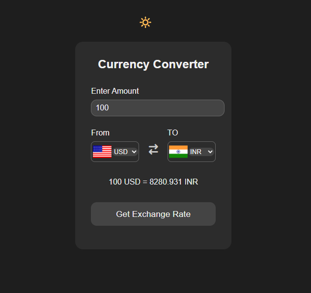

# Currency Converter
A simple and easy-to-use web application that allows users to convert currencies in real time using exchange rate data.

## 📷 Preview (Dark Mode)

## 🚀 Features

- 🔁 Convert between different world currencies
- 🌐 Real time exchange rates (via API)
- 🏳 Country flags next to currency codes
- 🌙 Light/Dark mode toggle
- 🗳️ The theme preference is saved in localStorage
- ✅ Responsive design for desktop & mobile
- 🧠 Easy to understand and extend

## 🛠️ Technologies Used

- HTML5
- CSS3
- JavaScript (Vanilla)
- [Font Awesome](https://fontawesome.com/) for icons
- [FlagsAPI](https://flagsapi.com/) for country flags
- [Exchange Rate API](https://2024-03-06.currency-api.pages.dev/v1/currencies)

## 🌐 Live Demo
[Try the Currency Converter](https://tannuu29.github.io/currency-converter/)
